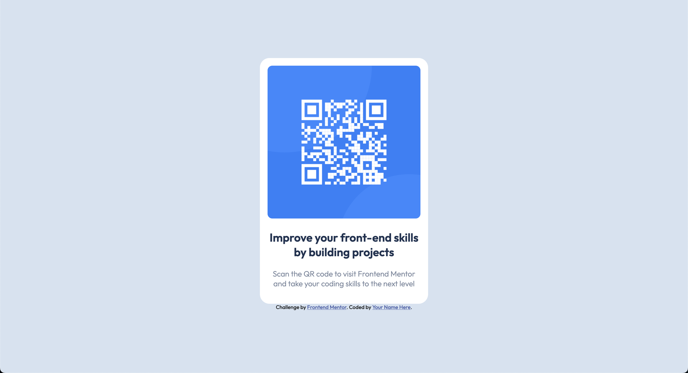

# Frontend Mentor - QR code component solution

This is a solution to the [QR code component challenge on Frontend Mentor](https://www.frontendmentor.io/challenges/qr-code-component-iux_sIO_H). 

## Table of contents

- [Overview](#overview)
  - [Screenshot](#screenshot)
  - [Links](#links)
- [My process](#my-process)
  - [Built with](#built-with)
  - [What I learned](#what-i-learned)
- [Author](#author)

## Overview

### Screenshot

### Links

- Solution URL: [https://github.com/dirkvankrieken/QR-Component/](https://github.com/dirkvankrieken/QR-Component/)
- Live Site URL: [https://dirkvankrieken.github.io/QR-Component](https://dirkvankrieken.github.io/QR-Component)

## My process

### Built with

- Semantic HTML5 markup
- CSS custom properties
- Flexbox
- Mobile-first workflow

### What I learned

I learned to use Fonts from Google Fonts, how to adjust the font-weight. 
I learned to vertically align an element using Flexbox.

## Author

- Frontend Mentor - [@dirkvankrieken](https://www.frontendmentor.io/profile/dirkvankrieken)
- Twitter - [@dirkvkr](https://www.twitter.com/dirkvkr)

